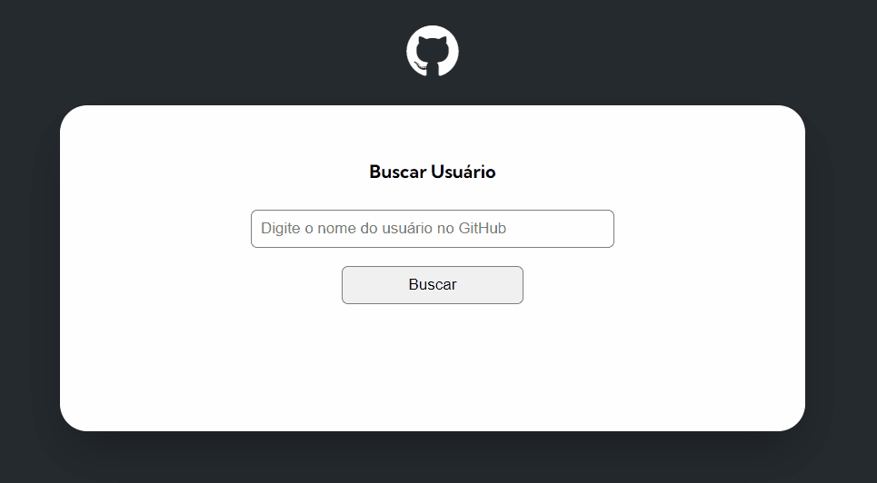
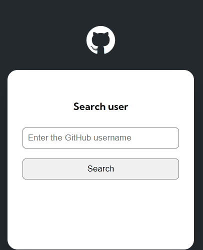

# Project-fetch-github-api

## Description
This is a project proposed by the DevQuest Course, which consists of a JavaScript module challenge. The goal is to create a search field where a user's name must be entered to access their profile. By clicking the "Search" button or pressing the "Enter" key, the system performs a query through the GitHub API, displaying the user's name, photo, bio description, and repositories.

## 💻 Overview of

## 📳 Responsive

## Technologies used

- HTML 
- CSS 
- JS
- API

 # Social media

 - 👋🏾 [Linkedin](https://www.linkedin.com/in/matheus17martins/)
 - 💻 [Github](https://github.com/ma17martins)

