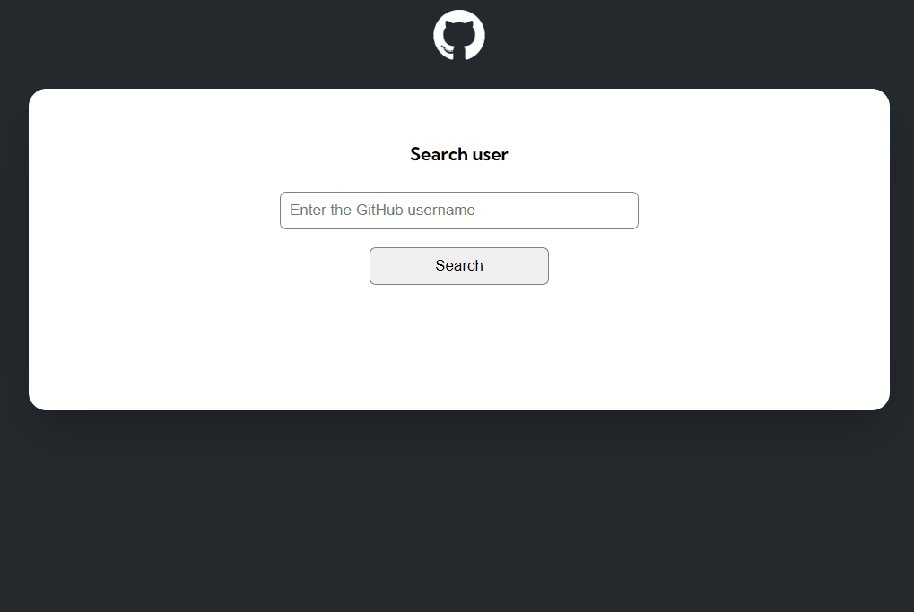
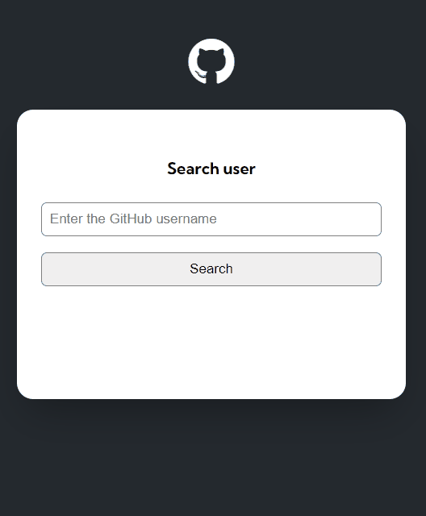

# Project-fetch-github-api

## Description
This is a project proposed by the DevQuest Course, which consists of a JavaScript module challenge. The objective is to create a search field where a user's name must be entered to access their profile. When clicking the “Search” button or pressing the “Enter” key, the system performs a query through the GitHub API, displaying the user's name, photo, bio description, repositories and a list of events carried out in the user's profile and the last commit of each event.

## 💻 Overview 

### Demonstration of the project when searching.

## 📳 Responsive
### Mobile version

## Technologies used

- HTML 
- CSS 
- JS
- Github API

 # Social media

 - 👋🏾 [Linkedin](https://www.linkedin.com/in/matheus17martins/)
 - 💻 [Project page](https://ma17martins.github.io/project-fetch-github-api/) 

